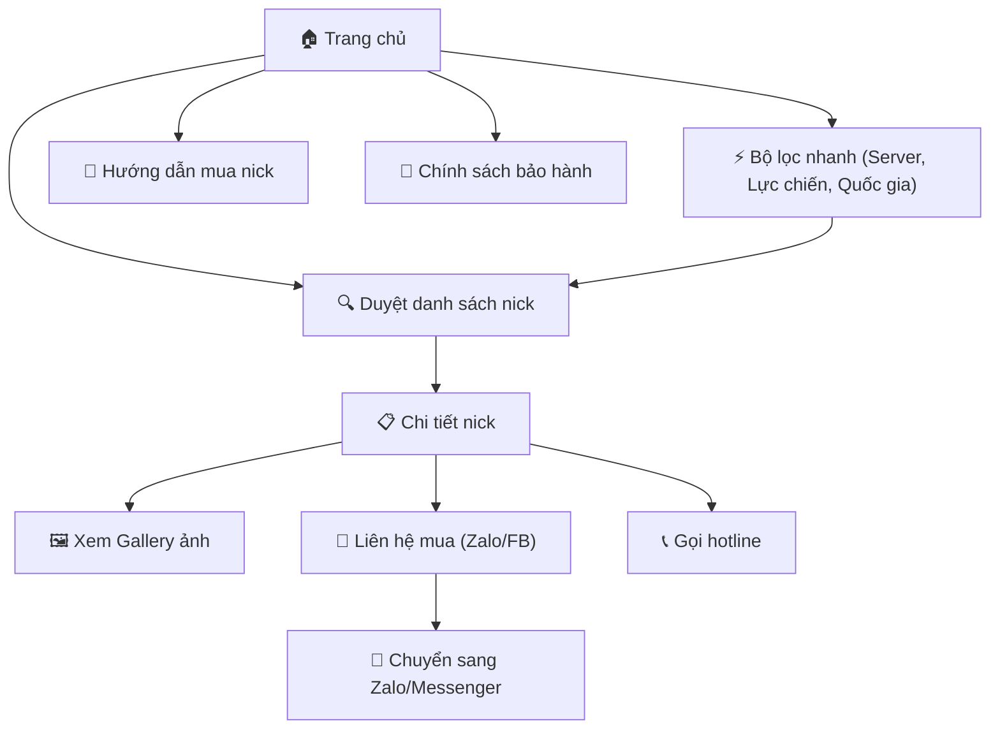
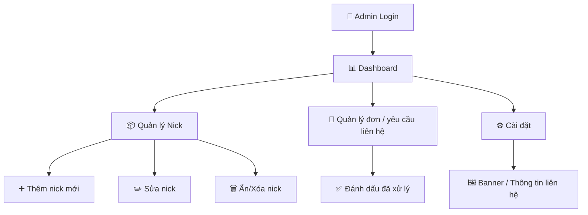
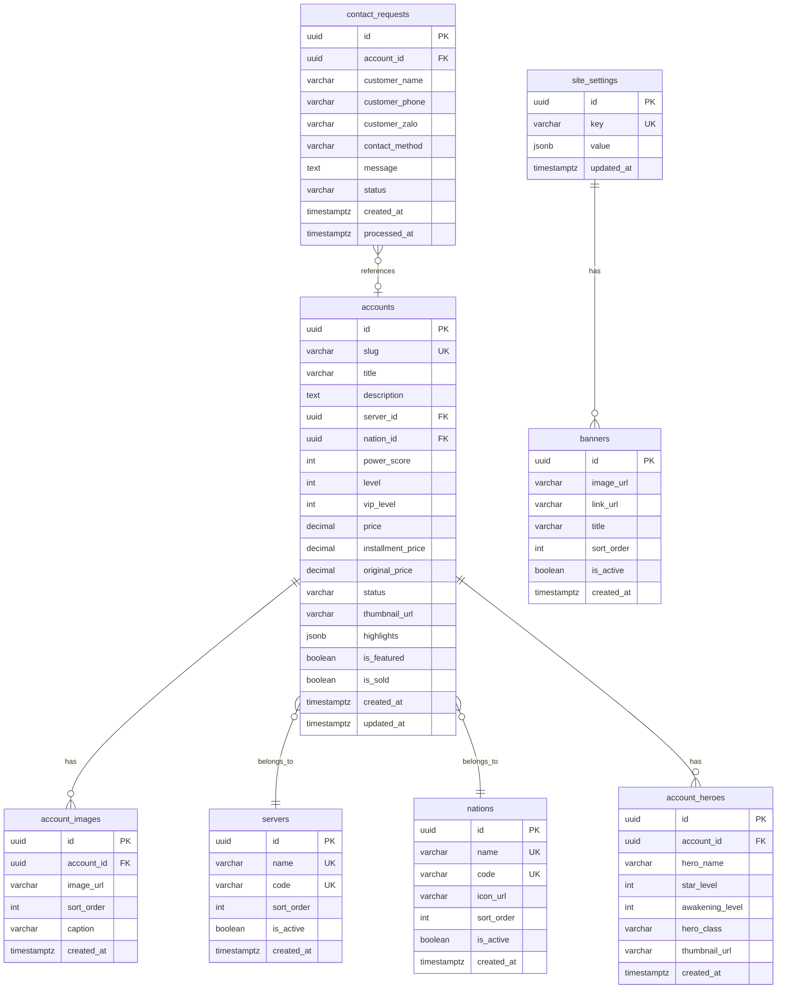
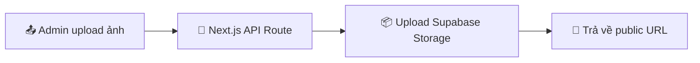
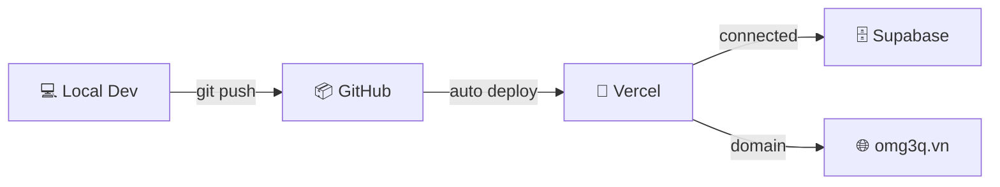

# 🎮 OMG 3Q — Master Architecture Plan

> **Dự án:** Website bán nick game OMG 3Q
> **Style:** [Listing bất động sản (Real-estate listing)](https://batdongsan.com.vn/)
> **Ngày tạo:** 2026-03-27
> **Phiên bản:** 1.1

> [!CAUTION]
> **CẤM THAY ĐỔI TECH STACK.** Mọi model thực thi sau này PHẢI bám sát plan này. Không được tự ý đổi framework, database, hoặc hosting platform.

---

## 📋 Mục lục

1. [Tech Stack](#1--tech-stack-cố-định)
2. [UI/UX Design System](#2--uiux-design-system)
3. [Sitemap & App Flow](#3--sitemap--app-flow)
4. [Database Schema](#4--database-schema-supabasepostgresql)
5. [API Endpoints](#5--api-endpoints)
6. [MCP Server Structure](#6--mcp-server-structure)
7. [Folder Structure](#7--folder-structure)
8. [Deployment & Hosting](#8--deployment--hosting)
9. [SEO Growth Plan](#9--seo-growth-plan-priority-1)

---

## 1. 🔒 Tech Stack (Cố định)

| Layer            | Technology                              | Ghi chú                                        |
| ---------------- | --------------------------------------- | ----------------------------------------------- |
| **Frontend**     | Next.js 14+ (App Router) + TypeScript | SSR/SSG cho SEO, React Server Components        |
| **Styling**      | Vanilla CSS + CSS Modules               | Không dùng Tailwind trừ khi user yêu cầu       |
| **Database**     | Supabase (PostgreSQL)                   | Auth, Realtime, Storage, Row Level Security     |
| **File Storage** | Supabase Storage                        | Ảnh nick, avatar tướng                          |
| **Admin Panel**  | Supabase Studio + Custom Admin Pages    | Quản lý nick, đơn hàng                         |
| **Auth**         | Supabase Auth                           | Admin login, Google OAuth optional              |
| **Hosting**      | Vercel                                  | Auto deploy từ GitHub                           |
| **SEO Engine**   | Next Metadata API + JSON-LD + GSC       | Technical SEO + rich results + indexing control |
| **Analytics**    | Google Analytics 4                      | Tracking page views, conversions                |
| **Contact**      | Zalo OA API + Facebook Messenger Plugin | Nút liên hệ nhanh                              |

> **Code Standard:** Toàn bộ code trong `web/` và `mcp-server/` dùng TypeScript. React components/pages/layout dùng `.tsx`; hooks, utilities, API routes, middleware dùng `.ts`.

---

## 2. 🎨 UI/UX Design System

> **Phong cách:** Kết hợp thẩm mỹ game OMG 3Q (Tam Quốc chibi, màu sắc rực rỡ) với layout listing chuyên nghiệp kiểu [batdongsan.com.vn](https://batdongsan.com.vn/).
> **Responsive-first:** Mobile → Tablet → Desktop.

### 2.1 Design Tokens (CSS Variables)

```css
:root {
  /* ═══════════════════════════════════════════════
     🎮 COLOR PALETTE — Lấy cảm hứng từ OMG 3Q
     Background: dark navy/indigo gradient
     Accent: vàng kim / cam lửa / đỏ chiến
     ═══════════════════════════════════════════════ */

  /* Primary — Dark Navy/Indigo (background chủ đạo) */
  --color-primary-900: #0a0e27;       /* Nền đậm nhất */
  --color-primary-800: #111640;       /* Nền header/footer */
  --color-primary-700: #1a1f5e;       /* Card background */
  --color-primary-600: #252b7a;       /* Hover states */
  --color-primary-500: #3038a0;       /* Active elements */

  /* Accent Gold — Vàng kim (CTA, giá, highlight) */
  --color-gold-500: #FFD700;          /* Vàng chính */
  --color-gold-400: #FFEA00;          /* Vàng sáng (hover) */
  --color-gold-600: #E6AC00;          /* Vàng đậm */
  --color-gold-gradient: linear-gradient(135deg, #FFD700 0%, #FFA500 100%);

  /* Accent Fire — Cam/Đỏ lửa (badge, sale, urgent) */
  --color-fire-500: #FF6B35;          /* Cam chính */
  --color-fire-600: #E5501A;          /* Cam đậm */
  --color-fire-400: #FF8C5A;          /* Cam nhạt */
  --color-fire-gradient: linear-gradient(135deg, #FF6B35 0%, #E53E3E 100%);

  /* Accent Red — Đỏ chiến (Tam Quốc) */
  --color-red-500: #DC2626;           /* Đỏ chính */
  --color-red-600: #B91C1C;           /* Đỏ đậm */

  /* Neutral — Trắng/Xám cho text trên nền tối */
  --color-white: #FFFFFF;
  --color-gray-50: #F8FAFC;           /* Nền sáng (content area) */
  --color-gray-100: #F1F5F9;          /* Nền card sáng */
  --color-gray-200: #E2E8F0;          /* Border nhạt */
  --color-gray-300: #CBD5E1;          /* Text muted */
  --color-gray-400: #94A3B8;          /* Placeholder */
  --color-gray-500: #64748B;          /* Text secondary */
  --color-gray-600: #475569;          /* Text body */
  --color-gray-700: #334155;          /* Text heading */
  --color-gray-800: #1E293B;          /* Text đậm */
  --color-gray-900: #0F172A;          /* Text darkest */

  /* Status Colors */
  --color-success: #22C55E;           /* Available / Còn hàng */
  --color-warning: #F59E0B;           /* Reserved / Đang giữ */
  --color-danger: #EF4444;            /* Sold / Đã bán */
  --color-info: #3B82F6;              /* Info */

  /* Nation Colors — Màu 3 nước */
  --color-nguy: #3B82F6;              /* Ngụy - Xanh dương */
  --color-thuc: #22C55E;              /* Thục - Xanh lá */
  --color-ngo: #EF4444;               /* Ngô  - Đỏ */

  /* ═══════════════════════════════════════════════
     📐 TYPOGRAPHY
     ═══════════════════════════════════════════════ */
  --font-primary: 'Inter', 'Roboto', -apple-system, sans-serif;
  --font-display: 'Outfit', 'Inter', sans-serif;   /* Headings, giá tiền */
  --font-mono: 'JetBrains Mono', monospace;         /* Mã nick, ID */

  --text-xs: 0.75rem;      /* 12px */
  --text-sm: 0.875rem;     /* 14px */
  --text-base: 1rem;       /* 16px */
  --text-lg: 1.125rem;     /* 18px */
  --text-xl: 1.25rem;      /* 20px */
  --text-2xl: 1.5rem;      /* 24px */
  --text-3xl: 1.875rem;    /* 30px */
  --text-4xl: 2.25rem;     /* 36px */

  --font-weight-normal: 400;
  --font-weight-medium: 500;
  --font-weight-semibold: 600;
  --font-weight-bold: 700;
  --font-weight-extrabold: 800;

  /* ═══════════════════════════════════════════════
     📏 SPACING & SIZING
     ═══════════════════════════════════════════════ */
  --space-1: 0.25rem;      /* 4px */
  --space-2: 0.5rem;       /* 8px */
  --space-3: 0.75rem;      /* 12px */
  --space-4: 1rem;         /* 16px */
  --space-5: 1.25rem;      /* 20px */
  --space-6: 1.5rem;       /* 24px */
  --space-8: 2rem;         /* 32px */
  --space-10: 2.5rem;      /* 40px */
  --space-12: 3rem;        /* 48px */
  --space-16: 4rem;        /* 64px */

  --radius-sm: 6px;
  --radius-md: 10px;
  --radius-lg: 16px;
  --radius-xl: 24px;
  --radius-full: 9999px;

  /* ═══════════════════════════════════════════════
     🌗 SHADOWS & EFFECTS
     ═══════════════════════════════════════════════ */
  --shadow-sm: 0 1px 3px rgba(0, 0, 0, 0.12);
  --shadow-md: 0 4px 12px rgba(0, 0, 0, 0.15);
  --shadow-lg: 0 8px 30px rgba(0, 0, 0, 0.2);
  --shadow-xl: 0 16px 48px rgba(0, 0, 0, 0.25);
  --shadow-glow-gold: 0 0 20px rgba(255, 215, 0, 0.3);
  --shadow-glow-fire: 0 0 20px rgba(255, 107, 53, 0.3);

  --blur-glass: blur(12px);
  --transition-fast: 150ms ease;
  --transition-normal: 250ms ease;
  --transition-slow: 400ms ease;

  /* ═══════════════════════════════════════════════
     📱 RESPONSIVE BREAKPOINTS
     ═══════════════════════════════════════════════ */
  --bp-mobile-s: 320px;     /* iPhone SE */
  --bp-mobile-m: 375px;     /* iPhone 12/13/14 */
  --bp-mobile-l: 428px;     /* iPhone 14 Pro Max */
  --bp-tablet: 768px;       /* iPad portrait */
  --bp-tablet-l: 1024px;    /* iPad landscape / iPad Pro portrait */
  --bp-desktop: 1280px;     /* Desktop */
  --bp-desktop-l: 1440px;   /* Desktop large */
  --bp-desktop-xl: 1920px;  /* Full HD */
}
```

### 2.2 Responsive Layout System

```
┌──────────────────────────────────────────────────────────────┐
│ Breakpoint       │ Grid Cols │ Sidebar    │ Card Width       │
├──────────────────┼───────────┼────────────┼──────────────────┤
│ Mobile (<768px)  │ 1-2 cols  │ Bottom     │ 100% / 50%       │
│                  │           │ Sheet      │                   │
├──────────────────┼───────────┼────────────┼──────────────────┤
│ Tablet           │ 2-3 cols  │ Collaps-   │ ~280px            │
│ (768-1024px)     │           │ ible top   │                   │
├──────────────────┼───────────┼────────────┼──────────────────┤
│ Desktop          │ 3-4 cols  │ Left side  │ ~300px            │
│ (1024px+)        │           │ fixed 280px│                   │
└──────────────────┴───────────┴────────────┴──────────────────┘
```

#### Responsive CSS Strategy

```css
/* Mobile first — Base styles = Mobile */

/* Tablet portrait */
@media (min-width: 768px) { ... }

/* Tablet landscape / Small desktop */
@media (min-width: 1024px) { ... }

/* Desktop */
@media (min-width: 1280px) { ... }

/* Large desktop */
@media (min-width: 1440px) { ... }
```

### 2.3 Bộ lọc giá — Price Filter (FOCUS)

> Lấy cảm hứng từ cách batdongsan.com.vn xử lý bộ lọc giá: **Các khoảng giá có sẵn (predefined) + Custom range**.

#### 2.3.1 Khoảng giá có sẵn (Predefined Price Ranges)

```
┌────────────────────────────────────────────────────────┐
│  💰 Khoảng giá                                         │
├────────────────────────────────────────────────────────┤
│  ○ Tất cả                                              │
│  ○ Dưới 500k                     (< 500,000₫)         │
│  ○ 500k  — 1 triệu               (500k - 1M)          │
│  ○ 1 triệu — 3 triệu             (1M - 3M)            │
│  ○ 3 triệu — 5 triệu             (3M - 5M)            │
│  ○ 5 triệu — 10 triệu            (5M - 10M)           │
│  ○ 10 triệu — 20 triệu           (10M - 20M)          │
│  ○ Trên 20 triệu                  (> 20M)              │
│  ────────────────────────────────                       │
│  📝 Nhập khoảng giá tùy chỉnh:                         │
│  [ Từ ___₫ ] ──── [ Đến ___₫ ]                         │
│                        [Áp dụng]                        │
└────────────────────────────────────────────────────────┘
```

#### 2.3.2 Price Filter — Data Structure

```ts
type PriceRange = {
  id: string;
  label: string;
  min: number | null;
  max: number | null;
};

const PRICE_RANGES: PriceRange[] = [
  { id: 'all',   label: 'Tất cả',              min: null, max: null     },
  { id: 'u500',  label: 'Dưới 500k',            min: null, max: 500000  },
  { id: '500-1m', label: '500k — 1 triệu',      min: 500000, max: 1000000 },
  { id: '1-3m',  label: '1 triệu — 3 triệu',   min: 1000000, max: 3000000 },
  { id: '3-5m',  label: '3 triệu — 5 triệu',   min: 3000000, max: 5000000 },
  { id: '5-10m', label: '5 triệu — 10 triệu',  min: 5000000, max: 10000000 },
  { id: '10-20m',label: '10 triệu — 20 triệu', min: 10000000, max: 20000000 },
  { id: 'o20m',  label: 'Trên 20 triệu',       min: 20000000, max: null },
];
```

#### 2.3.3 Price Filter — URL Sync (SEO-friendly)

```
/accounts?price_min=1000000&price_max=5000000&server=s1&nation=nguy
/accounts?price_range=3-5m&server=s1
```

> Bộ lọc giá **PHẢI sync 2 chiều với URL params** để SEO crawl được và user có thể share/bookmark link.

#### 2.3.4 Price Display Format

```ts
// Format function — hiển thị giá Việt Nam
formatPrice(500000 as number)    → "500k"
formatPrice(1000000 as number)   → "1 triệu"
formatPrice(1500000 as number)   → "1.5 triệu"
formatPrice(10000000 as number)  → "10 triệu"
formatPrice(25000000 as number)  → "25 triệu"

// Trên card: hiển thị giá gốc (gạch ngang) + giá bán
// 7.000.000₫  →  5.000.000₫  (giảm 29%)
```

### 2.4 Toàn bộ Filter Panel — Sidebar (Desktop) / Bottom Sheet (Mobile)

```
┌─────────────────────────────────────┐
│  🔍 BỘ LỌC NICK                     │
│─────────────────────────────────────│
│                                      │
│  🌐 Server                           │
│  ┌──────────────────────────────┐    │
│  │ Chọn server...            ▾ │    │
│  └──────────────────────────────┘    │
│  [S1] [S2] [S3] [S5] ... (chips)    │
│                                      │
│  🏴 Quốc gia                         │
│  [🔵 Ngụy] [🟢 Thục] [🔴 Ngô]       │
│                                      │
│  💰 Khoảng giá                       │
│  (See 2.3.1 above)                   │
│                                      │
│  ⚔️ Lực chiến                        │
│  ○──────────●──────────○            │
│  Min: 0    ████  Max: 10M+           │
│  [ 500.000 ] — [ 5.000.000 ]        │
│                                      │
│  🎖️ VIP Level                        │
│  ○ Tất cả  ○ VIP 8+  ○ VIP 12+     │
│                                      │
│  📊 Sắp xếp                          │
│  ┌──────────────────────────────┐    │
│  │ Mới nhất                  ▾ │    │
│  └──────────────────────────────┘    │
│  Options: Mới nhất, Giá tăng dần,   │
│  Giá giảm dần, Lực chiến cao nhất   │
│                                      │
│  [🔄 Xóa lọc]    [✅ Áp dụng (24)]  │
│                                      │
└─────────────────────────────────────┘
```

#### Mobile: Bottom Sheet Filter

```
┌─────────────────────┐
│  ☰  OMG 3Q Shop     │  ← Sticky header
├─────────────────────┤
│ [Server▾][Giá▾][Lọc]│  ← Horizontal scrollable filter chips
├─────────────────────┤
│                     │
│  Card  Card         │  ← 2 columns grid
│  Card  Card         │
│  ...                │
│                     │
├─────────────────────┤  ← Tap "Lọc" → Bottom sheet slides up
│░░░░░░░░░░░░░░░░░░░░░│
│  ═══ (drag handle)  │
│  BỘ LỌC             │
│  ...full filter...  │
│  [Xóa lọc] [Áp dụng]│
└─────────────────────┘
```

### 2.5 Account Listing Card (AccountCard)

```
┌──────────────────────────────────┐
│  ┌────────────────────────────┐  │
│  │                            │  │← Thumbnail (16:9 ratio)
│  │      📷 Ảnh nick game      │  │
│  │                            │  │
│  │  [🔥 HOT]     [Ngụy 🔵]   │  │← Badges overlay
│  └────────────────────────────┘  │
│                                  │
│  Nick VIP 12 — Full Tướng Đỏ    │← Title (max 2 lines, clamp)
│                                  │
│  ⚔️ 2.5M lực chiến  │ 🌐 S1    │← Metadata row
│  🎖️ VIP 12          │ Lv.120   │
│                                  │
│  ┌────────────────────────────┐  │
│  │ VIP 12 │ Full đỏ │ 3 Skin │  │← Highlight chips
│  └────────────────────────────┘  │
│                                  │
│  🔥 5.000.000₫                  │← Giá bán chính
│  💳 Góp từ 1.800.000₫           │← Giá góp tham khảo (nếu có)
│                                  │
│  [💬 Liên hệ ngay]              │← CTA Button
└──────────────────────────────────┘
```

#### Card Hover Effect (Desktop)

```css
.accountCard {
  transition: transform var(--transition-normal),
              box-shadow var(--transition-normal);
}
.accountCard:hover {
  transform: translateY(-4px);
  box-shadow: var(--shadow-lg);
}
/* Thumbnail zoom on hover */
.accountCard:hover .thumbnail img {
  transform: scale(1.05);
}
```

### 2.6 Page Layouts & Component Blueprint

#### 2.6.1 Trang chủ (`/`)

```
┌──────────────────────────────────────────────────────────┐
│  HEADER: Logo (trái) │ Menu │ Hotline │ Zalo (phải)     │
├──────────────────────────────────────────────────────────┤
│                                                          │
│  ╔══════════════════════════════════════════════════════╗ │
│  ║  HERO BANNER — Carousel                             ║ │
│  ║  "Mua bán nick OMG 3Q — Uy tín #1 Việt Nam"        ║ │
│  ║  [Xem tất cả nick →]                                ║ │
│  ╚══════════════════════════════════════════════════════╝ │
│                                                          │
│  ┌─ QUICK FILTERS BAR ──────────────────────────────┐    │
│  │ [Server▾] [Quốc gia▾] [Giá▾] [Lực chiến▾] [🔍]  │    │
│  └──────────────────────────────────────────────────┘    │
│                                                          │
│  ┌─ STATS COUNTER ──────────────────────────────────┐    │
│  │ 🎮 500+ Nick  │ ⭐ 200+ Đã bán │ 🤝 100% Uy tín  │    │
│  └──────────────────────────────────────────────────┘    │
│                                                          │
│  ═══ NICK NỔI BẬT ═══════════════════════════════════    │
│  [Card] [Card] [Card] [Card]    ← 4 cols desktop         │
│  [Card] [Card] [Card] [Card]                              │
│  [Xem thêm →]                                            │
│                                                          │
│  ═══ NICK MỚI NHẤT ═════════════════════════════════     │
│  [Card] [Card] [Card] [Card]                              │
│                                                          │
│  ═══ HƯỚNG DẪN MUA NICK ════════════════════════════     │
│  Step 1 → Step 2 → Step 3 → Step 4                       │
│                                                          │
├──────────────────────────────────────────────────────────┤
│  FOOTER: Logo │ Menu links │ Contact │ Social │ © 2026   │
└──────────────────────────────────────────────────────────┘

🔘 FLOATING CONTACT (fixed bottom-right):
   [💬 Zalo]
   [📘 FB Messenger]
   [📞 Hotline]
```

#### 2.6.2 Trang danh sách (`/accounts`)

```
Desktop (≥1024px):
┌────────────────────────────────────────────────────────────────┐
│  HEADER                                                       │
├────────────┬───────────────────────────────────────────────────┤
│            │ Đang hiện 24/120 nick │ [Grid ▦] [List ≡] │ Sort▾│
│  SIDEBAR   ├───────────────────────────────────────────────────┤
│  FILTERS   │                                                   │
│  (280px)   │  [Card] [Card] [Card] [Card]   ← 4 cols          │
│            │  [Card] [Card] [Card] [Card]                      │
│  Server    │  [Card] [Card] [Card] [Card]                      │
│  Quốc gia  │                                                   │
│  Giá 💰    │  ← 1 │ 2 │ 3 │ ... │ 10 │ → (Pagination)        │
│  Lực chiến │                                                   │
│  VIP       ├───────────────────────────────────────────────────┤
│  Sắp xếp   │                                                   │
│            │                                                   │
├────────────┴───────────────────────────────────────────────────┤
│  FOOTER                                                       │
└────────────────────────────────────────────────────────────────┘

Mobile (<768px):
┌───────────────────────┐
│  HEADER               │
├───────────────────────┤
│ [Server▾][Giá▾][🔽Lọc]│  ← Scrollable filter chips
├───────────────────────┤
│  24 kết quả           │
│  [Card] [Card]        │  ← 2 cols
│  [Card] [Card]        │
│  [Card] [Card]        │
│  [Xem thêm ↓]        │  ← Infinite scroll on mobile
├───────────────────────┤
│  FOOTER               │
└───────────────────────┘
```

#### 2.6.3 Trang chi tiết (`/accounts/[slug]`)

```
┌────────────────────────────────────────────────────────────┐
│  ← Quay lại danh sách  │  Nick VIP 12 — S1 — Ngụy         │
├─────────────────────────┬──────────────────────────────────┤
│                         │                                   │
│  ┌───────────────────┐  │  📋 THÔNG TIN NICK                │
│  │                   │  │                                   │
│  │  MAIN IMAGE       │  │  Title: Nick VIP 12 Full Đỏ      │
│  │  (Lightbox click) │  │  Server: S1                       │
│  │                   │  │  Quốc gia: 🔵 Ngụy               │
│  └───────────────────┘  │  Lực chiến: ⚔️ 2,500,000         │
│                         │  Level: 120                        │
│  ┌──┐ ┌──┐ ┌──┐ ┌──┐   │  VIP: 12                          │
│  │t1│ │t2│ │t3│ │t4│   │                                   │
│  └──┘ └──┘ └──┘ └──┘   │  ──────────────────────────        │
│  (thumbnail strip)      │  ~~7.000.000₫~~                   │
│                         │  🔥 5.000.000₫  [-29%]            │
│                         │                                   │
│                         │  [VIP 12] [Full đỏ] [3 Skin SS]   │
│                         │                                   │
│                         │  ┌──────────────────────────────┐ │
│                         │  │  💬 LIÊN HỆ MUA NICK          │ │
│                         │  │  [💬 Chat Zalo]               │ │
│                         │  │  [📘 Nhắn Facebook]           │ │
│                         │  │  [📞 Gọi 0123.456.789]       │ │
│                         │  └──────────────────────────────┘ │
├─────────────────────────┴──────────────────────────────────┤
│                                                             │
│  ═══ DANH SÁCH TƯỚNG ═══════════════════════════════════    │
│  ┌──────┐ ┌──────┐ ┌──────┐ ┌──────┐ ┌──────┐             │
│  │ ⭐⭐⭐ │ │ ⭐⭐⭐ │ │ ⭐⭐  │ │ ⭐⭐⭐ │ │ ⭐⭐  │             │
│  │ Lữ Bố │ │Quan V│ │Triệu │ │ Gia  │ │Hoàng │             │
│  │14 sao │ │13 sao│ │Vân   │ │Cát L │ │Trung │             │
│  └──────┘ └──────┘ └──────┘ └──────┘ └──────┘             │
│                                                             │
│  ═══ MÔ TẢ CHI TIẾT ═══════════════════════════════════    │
│  [Rich text description...]                                 │
│                                                             │
│  ═══ NICK TƯƠNG TỰ ════════════════════════════════════    │
│  [Card] [Card] [Card] [Card]                                │
│                                                             │
├─────────────────────────────────────────────────────────────┤
│  FOOTER                                                     │
└─────────────────────────────────────────────────────────────┘
```

### 2.7 Image Gallery Component Spec

```
Desktop: Click ảnh chính → Lightbox fullscreen
Mobile:  Swipe carousel (touch gestures)

Features:
- Lazy loading (IntersectionObserver)
- WebP format với fallback JPEG
- Thumbnail strip bên dưới ảnh chính
- Pinch-to-zoom trên mobile
- Keyboard navigation (← → Esc)
- Image counter: "3/12"
```

### 2.8 Floating Contact Widget

```
Position: fixed, bottom-right (bottom: 24px, right: 24px)
Z-index: 1000

Desktop:
  ┌──────────────────┐
  │ 💬 Chat Zalo     │  ← Expanded by default
  │ 📘 Messenger     │
  │ 📞 0123.456.789  │
  └──────────────────┘

Mobile:
  Single FAB button → Tap to expand
  ┌───┐
  │ 💬│  ← Collapsed = 1 icon (Zalo)
  └───┘
  Tap → expand to show all options
```

### 2.9 Animation & Micro-interaction

| Element              | Animation                                     |
| -------------------- | --------------------------------------------- |
| Card hover           | `translateY(-4px)` + shadow increase           |
| Card thumbnail       | `scale(1.05)` zoom on parent hover              |
| Filter chips         | Subtle scale bounce on select                  |
| Page transition      | Fade-in `opacity 0→1` + slight `translateY`    |
| Price tag             | Pulse glow effect on featured/sale items        |
| Skeleton loading     | Shimmer gradient animation (batdongsan style)   |
| Bottom sheet (mobile)| Slide up from bottom with backdrop blur          |
| Badge "HOT"/"MỚI"    | Subtle pulse animation                          |
| Floating contact     | Bounce entry animation on page load             |
| Gallery lightbox     | Fade + scale transition                         |
| Stats counter (home) | Count-up animation on scroll into view          |
| Filter result count  | Number transition animation                     |

---

## 3. 🗺️ Sitemap & App Flow

### 3.1 Sitemap

```
/                           → Trang chủ (Hero + Featured Listings + Bộ lọc nhanh)
/accounts                   → Danh sách nick (Grid/List view + Advanced Filters)
/accounts/[slug]            → Chi tiết nick (Gallery + Stats + Contact CTA)
/accounts/server/[server]   → Landing page theo server (SEO intent: "nick OMG 3Q Sx")
/accounts/nation/[nation]   → Landing page theo quốc gia (Ngụy/Thục/Ngô)
/accounts/vip-[level]       → Landing page theo phân khúc VIP (VIP 8, VIP 12...)
/lien-he                    → Trang liên hệ (Form + Zalo/FB links)
/huong-dan                  → Hướng dẫn mua nick
/chinh-sach                 → Chính sách bảo hành / đổi trả
/bang-gia-nick-omg3q        → Landing page bảng giá theo phân khúc
/blog                       → Hub bài viết SEO
/blog/[slug]                → Bài viết SEO chi tiết
/admin                      → Admin Dashboard (Protected)
/admin/login                → Đăng nhập admin CMS
/admin/accounts             → Quản lý danh sách nick
/admin/accounts/new         → Thêm nick mới
/admin/accounts/[id]/edit   → Sửa nick
/admin/orders               → Quản lý đơn hàng / yêu cầu liên hệ
/admin/settings             → Cài đặt website (banner, giá nổi bật, v.v.)
```

### 3.2 App Flow — Người mua



### 3.3 App Flow — Admin



### 3.4 SEO Landing Pages & Indexing Rules

```
1) Index các trang có search intent rõ ràng:
   - /accounts
   - /accounts/server/[server]
   - /accounts/nation/[nation]
   - /accounts/vip-[level]
   - /accounts/[slug]
   - /bang-gia-nick-omg3q
   - /blog, /blog/[slug]

2) Không index các URL lọc mỏng nội dung:
   - Query params quá chi tiết (nhiều filter kết hợp)
   - Trang phân trang sâu không có giá trị SEO riêng

3) Canonical:
   - Trang listing filter → canonical về landing page gần nhất
   - Trang account detail luôn self-canonical
```

---

## 4. 🗄️ Database Schema (Supabase/PostgreSQL)

### 4.1 ER Diagram



### 4.2 Chi tiết bảng & Index

#### `accounts` — Bảng chính chứa thông tin nick

```sql
CREATE TABLE accounts (
    id UUID DEFAULT gen_random_uuid() PRIMARY KEY,
    slug VARCHAR(255) NOT NULL UNIQUE,
    title VARCHAR(500) NOT NULL,
    description TEXT,
    server_id UUID NOT NULL REFERENCES servers(id),
    nation_id UUID REFERENCES nations(id),
    power_score INT NOT NULL DEFAULT 0,
    level INT NOT NULL DEFAULT 1,
    vip_level INT DEFAULT 0,
    price DECIMAL(15, 0) NOT NULL,
    installment_price DECIMAL(15, 0),
    original_price DECIMAL(15, 0),
    status VARCHAR(20) NOT NULL DEFAULT 'available'
        CHECK (status IN ('available', 'reserved', 'sold', 'hidden')),
    thumbnail_url VARCHAR(1000),
    highlights JSONB DEFAULT '[]'::jsonb,
    -- highlights example: ["VIP 12", "Full tướng đỏ", "Skin hiếm"]
    is_featured BOOLEAN DEFAULT false,
    is_sold BOOLEAN DEFAULT false,
    created_at TIMESTAMPTZ DEFAULT NOW(),
    updated_at TIMESTAMPTZ DEFAULT NOW()
);

-- 🔑 Index tối ưu cho bộ lọc
CREATE INDEX idx_accounts_server ON accounts(server_id) WHERE status = 'available';
CREATE INDEX idx_accounts_nation ON accounts(nation_id) WHERE status = 'available';
CREATE INDEX idx_accounts_power ON accounts(power_score) WHERE status = 'available';
CREATE INDEX idx_accounts_price ON accounts(price) WHERE status = 'available';
CREATE INDEX idx_accounts_featured ON accounts(is_featured, created_at DESC) WHERE status = 'available';
CREATE INDEX idx_accounts_slug ON accounts(slug);

-- Composite index cho bộ lọc kết hợp phổ biến
CREATE INDEX idx_accounts_filter_combo ON accounts(server_id, nation_id, power_score, price)
    WHERE status = 'available';

-- Full-text search (optional)
CREATE INDEX idx_accounts_search ON accounts USING gin(to_tsvector('simple', title || ' ' || COALESCE(description, '')));
```

#### `account_images` — Gallery ảnh cho mỗi nick

```sql
CREATE TABLE account_images (
    id UUID DEFAULT gen_random_uuid() PRIMARY KEY,
    account_id UUID NOT NULL REFERENCES accounts(id) ON DELETE CASCADE,
    image_url VARCHAR(1000) NOT NULL,
    sort_order INT DEFAULT 0,
    caption VARCHAR(500),
    created_at TIMESTAMPTZ DEFAULT NOW()
);

CREATE INDEX idx_account_images_account ON account_images(account_id, sort_order);
```

#### `account_heroes` — Danh sách tướng (champions) sở hữu

```sql
CREATE TABLE account_heroes (
    id UUID DEFAULT gen_random_uuid() PRIMARY KEY,
    account_id UUID NOT NULL REFERENCES accounts(id) ON DELETE CASCADE,
    hero_name VARCHAR(200) NOT NULL,
    star_level INT DEFAULT 1 CHECK (star_level BETWEEN 1 AND 15),
    awakening_level INT DEFAULT 0,
    hero_class VARCHAR(50),
    -- hero_class IN ('Tank', 'Mage', 'Archer', 'Support', 'Assassin')
    thumbnail_url VARCHAR(1000),
    created_at TIMESTAMPTZ DEFAULT NOW()
);

CREATE INDEX idx_account_heroes_account ON account_heroes(account_id);
```

#### `servers` — Danh sách Server game

```sql
CREATE TABLE servers (
    id UUID DEFAULT gen_random_uuid() PRIMARY KEY,
    name VARCHAR(100) NOT NULL UNIQUE,
    code VARCHAR(20) NOT NULL UNIQUE,
    sort_order INT DEFAULT 0,
    is_active BOOLEAN DEFAULT true,
    created_at TIMESTAMPTZ DEFAULT NOW()
);
```

#### `nations` — Quốc gia (Ngụy, Thục, Ngô)

```sql
CREATE TABLE nations (
    id UUID DEFAULT gen_random_uuid() PRIMARY KEY,
    name VARCHAR(100) NOT NULL UNIQUE,
    code VARCHAR(20) NOT NULL UNIQUE,
    icon_url VARCHAR(1000),
    sort_order INT DEFAULT 0,
    is_active BOOLEAN DEFAULT true,
    created_at TIMESTAMPTZ DEFAULT NOW()
);

-- Seed data
INSERT INTO nations (name, code, sort_order) VALUES
    ('Ngụy', 'nguy', 1),
    ('Thục', 'thuc', 2),
    ('Ngô', 'ngo', 3);
```

#### `contact_requests` — Lưu yêu cầu liên hệ mua nick

```sql
CREATE TABLE contact_requests (
    id UUID DEFAULT gen_random_uuid() PRIMARY KEY,
    account_id UUID REFERENCES accounts(id) ON DELETE SET NULL,
    customer_name VARCHAR(200),
    customer_phone VARCHAR(20),
    customer_zalo VARCHAR(200),
    contact_method VARCHAR(20) DEFAULT 'zalo'
        CHECK (contact_method IN ('zalo', 'facebook', 'phone', 'form')),
    message TEXT,
    status VARCHAR(20) DEFAULT 'new'
        CHECK (status IN ('new', 'contacted', 'completed', 'cancelled')),
    created_at TIMESTAMPTZ DEFAULT NOW(),
    processed_at TIMESTAMPTZ
);

CREATE INDEX idx_contact_requests_status ON contact_requests(status, created_at DESC);
CREATE INDEX idx_contact_requests_account ON contact_requests(account_id);
```

#### `site_settings` & `banners` — Cấu hình giao diện

```sql
CREATE TABLE site_settings (
    id UUID DEFAULT gen_random_uuid() PRIMARY KEY,
    key VARCHAR(100) NOT NULL UNIQUE,
    value JSONB NOT NULL,
    updated_at TIMESTAMPTZ DEFAULT NOW()
);

-- Seed settings
INSERT INTO site_settings (key, value) VALUES
    ('contact_info', '{"zalo": "0366710837", "facebook": "https://fb.com/omg3q", "phone": "0366710837", "email": "lienhe@omg3q.vn"}'::jsonb),
    ('site_meta', '{"title": "OMG 3Q - Mua bán nick uy tín", "description": "Chuyên mua bán nick OMG 3Q giá rẻ, uy tín #1"}'::jsonb),
    ('pricing_note', '{"text": "Giá đã bao gồm phí chuyển nick"}'::jsonb);

CREATE TABLE banners (
    id UUID DEFAULT gen_random_uuid() PRIMARY KEY,
    image_url VARCHAR(1000) NOT NULL,
    link_url VARCHAR(1000),
    title VARCHAR(200),
    sort_order INT DEFAULT 0,
    is_active BOOLEAN DEFAULT true,
    created_at TIMESTAMPTZ DEFAULT NOW()
);

CREATE INDEX idx_banners_active ON banners(is_active, sort_order);
```

### 4.3 Row Level Security (RLS)

```sql
-- Enable RLS on all tables
ALTER TABLE accounts ENABLE ROW LEVEL SECURITY;
ALTER TABLE account_images ENABLE ROW LEVEL SECURITY;
ALTER TABLE account_heroes ENABLE ROW LEVEL SECURITY;
ALTER TABLE servers ENABLE ROW LEVEL SECURITY;
ALTER TABLE nations ENABLE ROW LEVEL SECURITY;
ALTER TABLE contact_requests ENABLE ROW LEVEL SECURITY;
ALTER TABLE site_settings ENABLE ROW LEVEL SECURITY;
ALTER TABLE banners ENABLE ROW LEVEL SECURITY;

-- PUBLIC READ cho dữ liệu listing
CREATE POLICY "Public read accounts" ON accounts
    FOR SELECT USING (status IN ('available', 'reserved'));

CREATE POLICY "Public read account_images" ON account_images
    FOR SELECT USING (true);

CREATE POLICY "Public read account_heroes" ON account_heroes
    FOR SELECT USING (true);

CREATE POLICY "Public read servers" ON servers
    FOR SELECT USING (is_active = true);

CREATE POLICY "Public read nations" ON nations
    FOR SELECT USING (is_active = true);

CREATE POLICY "Public read banners" ON banners
    FOR SELECT USING (is_active = true);

CREATE POLICY "Public read site_settings" ON site_settings
    FOR SELECT USING (true);

-- PUBLIC INSERT cho contact_requests (khách gửi form)
CREATE POLICY "Public insert contact" ON contact_requests
    FOR INSERT WITH CHECK (true);

-- ADMIN FULL ACCESS (service_role hoặc authenticated admin)
CREATE POLICY "Admin full accounts" ON accounts
    FOR ALL USING (auth.role() = 'authenticated');

CREATE POLICY "Admin full images" ON account_images
    FOR ALL USING (auth.role() = 'authenticated');

CREATE POLICY "Admin full heroes" ON account_heroes
    FOR ALL USING (auth.role() = 'authenticated');

CREATE POLICY "Admin full servers" ON servers
    FOR ALL USING (auth.role() = 'authenticated');

CREATE POLICY "Admin full nations" ON nations
    FOR ALL USING (auth.role() = 'authenticated');

CREATE POLICY "Admin full contacts" ON contact_requests
    FOR ALL USING (auth.role() = 'authenticated');

CREATE POLICY "Admin full settings" ON site_settings
    FOR ALL USING (auth.role() = 'authenticated');

CREATE POLICY "Admin full banners" ON banners
    FOR ALL USING (auth.role() = 'authenticated');
```

### 4.4 Supabase Storage Buckets

```
Buckets:
├── account-images/          → Ảnh chụp màn hình nick game
│   └── {account_id}/       → Folder theo ID account
│       ├── thumb.webp       → Thumbnail chính
│       ├── 1.webp           → Ảnh gallery
│       ├── 2.webp
│       └── ...
├── hero-thumbnails/         → Ảnh tướng (icon)
├── banners/                 → Ảnh banner trang chủ
└── site-assets/             → Logo, favicon, og-image, v.v.
```

### 4.5 Image Upload Flow

> Ảnh nick game được upload trực tiếp lên Supabase Storage để admin quản lý gallery nhanh và đơn giản.

#### Upload Rules

```
- Giữ nguyên ảnh gốc theo định dạng upload hợp lệ
- Dung lượng tối đa: 10MB / ảnh
- Lưu theo thư mục account_id để dễ thay ảnh / xóa ảnh / reorder
- Admin CMS phải hỗ trợ xóa từng ảnh, thêm ảnh mới mà không mất ảnh cũ, đổi thứ tự ảnh và chọn thumbnail riêng cho từng nick
- Luồng upload dùng signed upload URL lên Supabase Storage, sau đó đồng bộ `account_images` và `accounts.thumbnail_url` theo gallery state cuối cùng
```

#### Processing Flow



---

## 5. 🔌 API Endpoints

> Tất cả API sử dụng **Supabase Client SDK** (REST tự động từ PostgREST) + một số **Next.js API Routes** cho logic nghiệp vụ phức tạp.

### 5.1 Public API (Supabase Client / Next.js API Routes)

#### Accounts (Nick game)

| Method | Endpoint                          | Mô tả                          | Query Params                                                                  |
| ------ | --------------------------------- | ------------------------------- | ----------------------------------------------------------------------------- |
| `GET`  | `/api/accounts`                   | Danh sách nick (có filter)      | `server`, `nation`, `power_min`, `power_max`, `price_min`, `price_max`, `sort`, `page`, `limit`, `search` |
| `GET`  | `/api/accounts/[slug]`            | Chi tiết 1 nick                 |                                                                               |
| `GET`  | `/api/accounts/featured`          | Nick nổi bật (homepage)         | `limit`                                                                       |
| `GET`  | `/api/accounts/[slug]/images`     | Gallery ảnh của nick            |                                                                               |
| `GET`  | `/api/accounts/[slug]/heroes`     | Danh sách tướng của nick        |                                                                               |

#### Filters Metadata

| Method | Endpoint             | Mô tả                             |
| ------ | -------------------- | ---------------------------------- |
| `GET`  | `/api/servers`       | Danh sách Server (cho dropdown)    |
| `GET`  | `/api/nations`       | Danh sách Quốc gia (cho dropdown)  |
| `GET`  | `/api/filters/stats` | Min/Max lực chiến, giá (cho slider)|

#### Contact

| Method | Endpoint               | Mô tả                      |
| ------ | ---------------------- | --------------------------- |
| `POST` | `/api/contact`         | Gửi yêu cầu liên hệ mua   |

#### Site

| Method | Endpoint              | Mô tả                        |
| ------ | --------------------- | ----------------------------- |
| `GET`  | `/api/site/settings`  | Lấy thông tin site (Zalo, FB) |
| `GET`  | `/api/site/banners`   | Danh sách banner active       |

### 5.2 Admin API (Protected — Supabase Auth Required)

#### Admin Auth

| Method   | Endpoint                    | Mô tả                                  |
| -------- | --------------------------- | -------------------------------------- |
| `POST`   | `/api/admin/session`        | Đăng nhập admin, tạo phiên `HttpOnly`  |
| `DELETE` | `/api/admin/session`        | Đăng xuất admin, xóa phiên hiện tại    |

#### Account Management

| Method   | Endpoint                             | Mô tả                    |
| -------- | ------------------------------------ | ------------------------- |
| `GET`    | `/api/admin/accounts`                | Danh sách nick (admin)    |
| `POST`   | `/api/admin/accounts`                | Tạo nick mới              |
| `PUT`    | `/api/admin/accounts/[id]`           | Cập nhật nick             |
| `DELETE` | `/api/admin/accounts/[id]`           | Xóa nick                  |
| `PATCH`  | `/api/admin/accounts/[id]/status`    | Đổi trạng thái nick       |
| `POST`   | `/api/admin/accounts/[id]/images`    | Upload ảnh gallery |
| `DELETE` | `/api/admin/accounts/[id]/images/[imageId]` | Xóa ảnh             |
| `PUT`    | `/api/admin/accounts/[id]/images/reorder`   | Sắp xếp ảnh         |
| `POST`   | `/api/admin/accounts/[id]/heroes`    | Thêm tướng vào nick       |
| `DELETE` | `/api/admin/accounts/[id]/heroes/[heroId]`  | Xóa tướng            |

#### Contact Request Management

| Method   | Endpoint                              | Mô tả                         |
| -------- | ------------------------------------- | ------------------------------ |
| `GET`    | `/api/admin/contacts`                 | Danh sách yêu cầu liên hệ      |
| `PATCH`  | `/api/admin/contacts/[id]/status`     | Cập nhật trạng thái xử lý       |
| `DELETE` | `/api/admin/contacts/[id]`            | Xóa yêu cầu                    |

#### Server & Nation Management

| Method   | Endpoint                     | Mô tả               |
| -------- | ---------------------------- | -------------------- |
| `POST`   | `/api/admin/servers`         | Thêm server          |
| `PUT`    | `/api/admin/servers/[id]`    | Sửa server           |
| `DELETE` | `/api/admin/servers/[id]`    | Xóa server           |
| `POST`   | `/api/admin/nations`         | Thêm quốc gia        |
| `PUT`    | `/api/admin/nations/[id]`    | Sửa quốc gia         |
| `DELETE` | `/api/admin/nations/[id]`    | Xóa quốc gia         |

#### Site Settings

| Method | Endpoint                      | Mô tả                        |
| ------ | ----------------------------- | ----------------------------- |
| `PUT`  | `/api/admin/settings/[key]`   | Cập nhật cài đặt site         |
| `POST` | `/api/admin/banners`          | Thêm banner                   |
| `PUT`  | `/api/admin/banners/[id]`     | Sửa banner                    |
| `DELETE`| `/api/admin/banners/[id]`    | Xóa banner                    |

#### Dashboard

| Method | Endpoint                 | Mô tả                              |
| ------ | ------------------------ | ----------------------------------- |
| `GET`  | `/api/admin/dashboard`   | Thống kê (tổng nick, đã bán, doanh thu ước tính, contact mới)|

### 5.3 Ví dụ Request/Response

#### `GET /api/accounts?server=s1&nation=nguy&power_min=500000&sort=price_asc&page=1&limit=12`

```json
{
  "data": [
    {
      "id": "uuid-1",
      "slug": "nick-vip-12-full-tuong-do",
      "title": "Nick VIP 12 - Full tướng đỏ - 2.5M lực chiến",
      "server": { "id": "s-uuid", "name": "S1", "code": "s1" },
      "nation": { "id": "n-uuid", "name": "Ngụy", "code": "nguy" },
      "power_score": 2500000,
      "level": 120,
      "vip_level": 12,
      "price": 5000000,
      "installment_price": 1800000,
      "original_price": 7000000,
      "thumbnail_url": "https://xxx.supabase.co/storage/v1/...",
      "highlights": ["VIP 12", "Full tướng đỏ", "3 skin SS"],
      "is_featured": true,
      "created_at": "2026-03-27T07:00:00Z"
    }
  ],
  "pagination": {
    "page": 1,
    "limit": 12,
    "total": 45,
    "total_pages": 4
  },
  "filters_applied": {
    "server": "s1",
    "nation": "nguy",
    "power_min": 500000
  }
}
```

#### `POST /api/contact`

```json
// Request
{
  "account_id": "uuid-1",
  "customer_name": "Minh",
  "customer_phone": "0987654321",
  "customer_zalo": "0987654321",
  "contact_method": "zalo",
  "message": "Mình muốn mua nick này, check giá cuối"
}

// Response
{
  "success": true,
  "message": "Yêu cầu đã được ghi nhận. Chúng tôi sẽ liên hệ trong 30 phút."
}
```

---

## 6. 🔧 MCP Server Structure

> MCP (Model Context Protocol) Server cho phép các AI model khác truy xuất dữ liệu và file của project một cách có cấu trúc.

### 6.1 MCP Server Config

```json
{
  "name": "omg3q-mcp-server",
  "version": "1.0.0",
  "description": "MCP Server for OMG 3Q Account Selling Website",
  "transport": "stdio",
  "capabilities": {
    "resources": true,
    "tools": true,
    "prompts": true
  }
}
```

### 6.2 Resources (Dữ liệu tĩnh / file project)

| Resource URI                     | Mô tả                                   |
| -------------------------------- | ---------------------------------------- |
| `project://master-plan`          | File master-plan.md (bản thiết kế gốc)    |
| `project://schema`               | Database schema SQL                       |
| `project://api-docs`             | API documentation                         |
| `project://folder-structure`     | Project folder structure                  |
| `project://env-template`         | Environment variables template            |
| `project://components-list`      | Danh sách React components                |
| `project://design-tokens`        | CSS variables / design tokens             |

### 6.3 Tools (Truy xuất dữ liệu runtime)

| Tool Name                  | Input                                       | Output                | Mô tả                                  |
| -------------------------- | ------------------------------------------- | --------------------- | --------------------------------------- |
| `get_accounts`             | `{filters, sort, page, limit}`              | Account[]             | Lấy danh sách nick theo bộ lọc          |
| `get_account_detail`       | `{slug}`                                    | Account + Images + Heroes | Chi tiết nick                       |
| `get_servers`              | `{}`                                        | Server[]              | Danh sách servers                        |
| `get_nations`              | `{}`                                        | Nation[]              | Danh sách quốc gia                       |
| `get_filter_stats`         | `{}`                                        | `{power_min, power_max, price_min, price_max}` | Giá trị min/max cho slider |
| `get_site_settings`        | `{key?}`                                    | Settings              | Cấu hình site                            |
| `get_dashboard_stats`      | `{}`                                        | DashboardStats        | Thống kê tổng quan                       |
| `create_account`           | `{title, server_id, nation_id, ...}`        | Account               | Tạo nick mới (Admin)                    |
| `update_account`           | `{id, ...fields}`                           | Account               | Cập nhật nick (Admin)                    |
| `upload_account_image`     | `{account_id, image_base64}`                | ImageURL              | Upload ảnh nick (Admin)                  |
| `search_accounts`          | `{query}`                                   | Account[]             | Full-text search nick                    |
| `get_contact_requests`     | `{status?, page, limit}`                    | ContactRequest[]      | Danh sách liên hệ (Admin)               |

### 6.4 Prompts (Hướng dẫn cho model)

| Prompt Name              | Mô tả                                                         |
| ------------------------ | -------------------------------------------------------------- |
| `implement-component`    | Hướng dẫn implement 1 React component theo design system       |
| `add-api-route`          | Hướng dẫn thêm 1 Next.js API route theo pattern có sẵn        |
| `create-page`            | Hướng dẫn tạo 1 page mới theo sitemap                         |
| `modify-schema`          | Hướng dẫn sửa database schema đúng convention                 |
| `debug-supabase`         | Hướng dẫn debug Supabase query / RLS / Storage                |

### 6.5 MCP Server Implementation

```
d:\omg3q\mcp-server\
├── index.ts                  → Entry point (stdio transport)
├── resources/
│   ├── project-files.ts      → Serve project files as resources
│   └── registry.ts           → Resource URI registry
├── tools/
│   ├── accounts.ts           → get_accounts, get_account_detail, create, update
│   ├── filters.ts            → get_servers, get_nations, get_filter_stats
│   ├── site.ts               → get_site_settings, get_dashboard_stats
│   ├── images.ts             → upload_account_image
│   └── contacts.ts           → get_contact_requests
├── prompts/
│   ├── implement-component.ts
│   ├── add-api-route.ts
│   ├── create-page.ts
│   ├── modify-schema.ts
│   └── debug-supabase.ts
├── lib/
│   ├── supabase.ts           → Supabase client (service_role)
│   └── utils.ts              → Shared utilities
├── package.json
└── tsconfig.json
```

---

## 7. 📁 Folder Structure

```
d:\omg3q\
├── 📄 master-plan.md                    → BẢN THIẾT KẾ GỐC (file này)
├── 📂 web/                              → Next.js Application
│   ├── 📄 package.json
│   ├── 📄 tsconfig.json
│   ├── 📄 next.config.ts
│   ├── 📄 next-env.d.ts
│   ├── 📄 eslint.config.mjs
│   ├── 📄 .env.example                 → Environment template để local setup nhanh
│   ├── 📄 .env.local                   → Supabase keys (KHÔNG commit)
│   ├── 📂 public/
│   │   ├── favicon.ico
│   │   ├── og-image.png
│   │   └── 📂 images/                  → Static assets
│   ├── 📂 src/
│   │   ├── 📂 app/                     → Next.js App Router
│   │   │   ├── layout.tsx              → Root layout (fonts, metadata)
│   │   │   ├── page.tsx                → Trang chủ
│   │   │   ├── robots.ts               → Robots directives
│   │   │   ├── sitemap.ts              → XML sitemap index
│   │   │   ├── globals.css             → Global styles + CSS variables
│   │   │   ├── 📂 accounts/
│   │   │   │   ├── page.tsx            → Danh sách nick
│   │   │   │   ├── 📂 server/
│   │   │   │   │   └── 📂 [server]/
│   │   │   │   │       └── page.tsx    → Landing page theo server
│   │   │   │   ├── 📂 nation/
│   │   │   │   │   └── 📂 [nation]/
│   │   │   │   │       └── page.tsx    → Landing page theo quốc gia
│   │   │   │   └── 📂 [slug]/
│   │   │   │       └── page.tsx        → Chi tiết nick
│   │   │   ├── 📂 blog/
│   │   │   │   ├── page.tsx            → Blog hub
│   │   │   │   └── 📂 [slug]/
│   │   │   │       └── page.tsx        → Bài viết SEO
│   │   │   ├── 📂 bang-gia-nick-omg3q/
│   │   │   │   └── page.tsx            → Landing page bảng giá
│   │   │   ├── 📂 lien-he/
│   │   │   │   └── page.tsx            → Trang liên hệ
│   │   │   ├── 📂 huong-dan/
│   │   │   │   └── page.tsx            → Hướng dẫn mua nick
│   │   │   ├── 📂 chinh-sach/
│   │   │   │   └── page.tsx            → Chính sách bảo hành
│   │   │   ├── 📂 admin/               → Protected Admin Area
│   │   │   │   ├── layout.tsx          → Admin layout + auth guard
│   │   │   │   ├── page.tsx            → Dashboard
│   │   │   │   ├── 📂 login/
│   │   │   │   │   └── page.tsx        → Đăng nhập admin
│   │   │   │   ├── 📂 accounts/
│   │   │   │   │   ├── page.tsx        → Quản lý nick
│   │   │   │   │   ├── 📂 new/
│   │   │   │   │   │   └── page.tsx    → Thêm nick
│   │   │   │   │   └── 📂 [id]/
│   │   │   │   │       └── 📂 edit/
│   │   │   │   │           └── page.tsx → Sửa nick
│   │   │   │   ├── 📂 orders/
│   │   │   │   │   └── page.tsx        → Quản lý đơn/liên hệ
│   │   │   │   └── 📂 settings/
│   │   │   │       └── page.tsx        → Cài đặt site
│   │   │   └── 📂 api/                 → API Routes
│   │   │       ├── 📂 accounts/
│   │   │       │   ├── route.ts        → GET: list accounts
│   │   │       │   ├── 📂 featured/
│   │   │       │   │   └── route.ts    → GET: featured accounts
│   │   │       │   └── 📂 [slug]/
│   │   │       │       ├── route.ts    → GET: account detail
│   │   │       │       ├── 📂 images/
│   │   │       │       │   └── route.ts
│   │   │       │       └── 📂 heroes/
│   │   │       │           └── route.ts
│   │   │       ├── 📂 servers/
│   │   │       │   └── route.ts
│   │   │       ├── 📂 nations/
│   │   │       │   └── route.ts
│   │   │       ├── 📂 contact/
│   │   │       │   └── route.ts        → POST: submit contact
│   │   │       ├── 📂 filters/
│   │   │       │   └── 📂 stats/
│   │   │       │       └── route.ts
│   │   │       ├── 📂 site/
│   │   │       │   ├── 📂 settings/
│   │   │       │   │   └── route.ts
│   │   │       │   └── 📂 banners/
│   │   │       │       └── route.ts
│   │   │       └── 📂 admin/           → Protected API Routes
│   │   │           ├── 📂 session/
│   │   │           │   └── route.ts    → POST login / DELETE logout
│   │   │           ├── 📂 accounts/
│   │   │           │   ├── route.ts
│   │   │           │   └── 📂 [id]/
│   │   │           │       ├── route.ts
│   │   │           │       ├── 📂 status/
│   │   │           │       │   └── route.ts
│   │   │           │       ├── 📂 images/
│   │   │           │       │   ├── route.ts
│   │   │           │       │   ├── 📂 reorder/
│   │   │           │       │   │   └── route.ts
│   │   │           │       │   └── 📂 [imageId]/
│   │   │           │       │       └── route.ts
│   │   │           │       └── 📂 heroes/
│   │   │           │           ├── route.ts
│   │   │           │           └── 📂 [heroId]/
│   │   │           │               └── route.ts
│   │   │           ├── 📂 contacts/
│   │   │           │   ├── route.ts
│   │   │           │   └── 📂 [id]/
│   │   │           │       ├── route.ts
│   │   │           │       └── 📂 status/
│   │   │           │           └── route.ts
│   │   │           ├── 📂 servers/
│   │   │           │   ├── route.ts
│   │   │           │   └── 📂 [id]/
│   │   │           │       └── route.ts
│   │   │           ├── 📂 nations/
│   │   │           │   ├── route.ts
│   │   │           │   └── 📂 [id]/
│   │   │           │       └── route.ts
│   │   │           ├── 📂 settings/
│   │   │           │   └── 📂 [key]/
│   │   │           │       └── route.ts
│   │   │           ├── 📂 banners/
│   │   │           │   ├── route.ts
│   │   │           │   └── 📂 [id]/
│   │   │           │       └── route.ts
│   │   │           └── 📂 dashboard/
│   │   │               └── route.ts
│   │   ├── 📂 components/              → React Components
│   │   │   ├── 📂 layout/
│   │   │   │   ├── Header.tsx          → Navbar + logo + menu
│   │   │   │   ├── Footer.tsx          → Footer + social links
│   │   │   │   ├── Header.module.css
│   │   │   │   └── Footer.module.css
│   │   │   ├── 📂 home/
│   │   │   │   ├── HeroBanner.tsx      → Hero section + CTA
│   │   │   │   ├── FeaturedAccounts.tsx → Nick nổi bật
│   │   │   │   ├── QuickFilters.tsx    → Bộ lọc nhanh
│   │   │   │   ├── StatsCounter.tsx    → Bộ đếm thống kê
│   │   │   │   └── *.module.css
│   │   │   ├── 📂 accounts/
│   │   │   │   ├── AccountCard.tsx     → Card hiển thị 1 nick
│   │   │   │   ├── AccountGrid.tsx     → Grid danh sách nick
│   │   │   │   ├── AccountFilters.tsx  → Panel bộ lọc (sidebar)
│   │   │   │   ├── AccountDetail.tsx   → Chi tiết nick
│   │   │   │   ├── ImageGallery.tsx    → Lightbox gallery ảnh
│   │   │   │   ├── HeroList.tsx        → Danh sách tướng
│   │   │   │   ├── PriceTag.tsx        → Hiển thị giá + giảm giá
│   │   │   │   ├── PowerBadge.tsx      → Badge lực chiến
│   │   │   │   ├── Pagination.tsx      → Phân trang
│   │   │   │   └── *.module.css
│   │   │   ├── 📂 contact/
│   │   │   │   ├── ContactForm.tsx     → Form liên hệ
│   │   │   │   ├── FloatingContact.tsx → Nút Zalo/FB floating
│   │   │   │   ├── ContactButtons.tsx  → Zalo + FB + Phone buttons
│   │   │   │   └── *.module.css
│   │   │   ├── 📂 admin/
│   │   │   │   ├── AccountForm.tsx     → Form tạo/sửa nick
│   │   │   │   ├── ImageUploader.tsx   → Drag & drop upload ảnh
│   │   │   │   ├── HeroManager.tsx     → CRUD tướng trong nick
│   │   │   │   ├── DataTable.tsx       → Bảng dữ liệu admin
│   │   │   │   ├── StatsCard.tsx       → Card thống kê dashboard
│   │   │   │   ├── AdminSidebar.tsx    → Sidebar navigation
│   │   │   │   └── *.module.css
│   │   │   └── 📂 ui/                  → Shared UI components
│   │   │       ├── Button.tsx
│   │   │       ├── Input.tsx
│   │   │       ├── Select.tsx
│   │   │       ├── Modal.tsx
│   │   │       ├── Badge.tsx
│   │   │       ├── Skeleton.tsx
│   │   │       ├── Toast.tsx
│   │   │       ├── RangeSlider.tsx     → Slider cho lọc lực chiến/giá
│   │   │       └── *.module.css
│   │   ├── 📂 lib/                     → Utilities & Config
│   │   │   ├── accounts.ts             → Server-side queries cho account listing/detail
│   │   │   ├── blog-data.ts            → Nội dung blog tĩnh giai đoạn đầu
│   │   │   ├── supabase-client.ts      → Supabase browser client
│   │   │   ├── supabase-server.ts      → Supabase server client
│   │   │   ├── supabase-admin.ts       → Supabase admin (service_role)
│   │   │   ├── seo.ts                  → Title/meta/canonical builders
│   │   │   ├── schema.ts               → JSON-LD schema generators
│   │   │   ├── types.ts                → Shared app/domain types
│   │   │   ├── utils.ts                → Format price, slug, etc.
│   │   │   └── constants.ts            → Static constants
│   │   └── 📂 hooks/                   → Custom React Hooks
│   │       ├── useAccounts.ts          → Fetch + filter accounts
│   │       ├── useFilters.ts           → Manage filter state (URL params)
│   │       ├── useAuth.ts              → Admin authentication
│   │       └── useDebounce.ts          → Debounce cho search
│   └── 📄 middleware.ts                → Auth middleware cho /admin/*
├── 📂 database/                         → Database Scripts
│   ├── 📄 schema.sql                   → Full schema creation
│   ├── 📄 seed.sql                     → Sample data
│   ├── 📄 rls-policies.sql            → Row Level Security
│   └── 📄 indexes.sql                 → Performance indexes
├── 📂 mcp-server/                       → MCP Server
│   ├── 📄 package.json
│   ├── 📄 tsconfig.json
│   ├── 📄 index.ts
│   ├── 📂 resources/
│   ├── 📂 tools/
│   ├── 📂 prompts/
│   └── 📂 lib/
└── 📄 .gitignore
```

---

## 8. 🚀 Deployment & Hosting

### 8.1 Environment Variables (`.env.local`)

```env
# Supabase
NEXT_PUBLIC_SUPABASE_URL=https://xxxxx.supabase.co
NEXT_PUBLIC_SUPABASE_ANON_KEY=eyJhbGciOi...
SUPABASE_SERVICE_ROLE_KEY=eyJhbGciOi...

# Site
NEXT_PUBLIC_SITE_URL=https://omg3q.vn
NEXT_PUBLIC_SITE_NAME=OMG 3Q Shop

# Contact
NEXT_PUBLIC_ZALO_LINK=https://zalo.me/0366710837
NEXT_PUBLIC_FB_PAGE=https://m.me/omg3qshop
NEXT_PUBLIC_PHONE=0366710837

# Admin Auth
ADMIN_ALLOWED_EMAILS=admin@omg3q.vn
ADMIN_SESSION_SECRET=replace-with-random-32-char-secret
SUPABASE_STORAGE_BUCKET=account-images

# Analytics
NEXT_PUBLIC_GA_ID=G-XXXXXXXXXX
NEXT_PUBLIC_GSC_VERIFICATION=google-site-verification-code
```

### 8.2 Deployment Pipeline



### 8.3 Checklist trước go-live

- [ ] Setup Supabase project + run `schema.sql`
- [ ] Setup Supabase Storage buckets + policies
- [ ] Deploy Next.js lên Vercel
- [ ] Kết nối domain `omg3q.vn`
- [ ] Config SSL (auto từ Vercel)
- [ ] Seed dữ liệu mẫu
- [ ] Test toàn bộ API
- [ ] Config Google Analytics
- [ ] Connect Google Search Console + submit sitemap
- [ ] Setup robots.txt + canonical rules + noindex policy cho filter mỏng
- [ ] Config Zalo OA
- [ ] Setup metadata template (title, description, OG/Twitter) cho mọi page type
- [ ] Inject JSON-LD: Organization, Breadcrumb, ItemList, Product, FAQ
- [ ] Performance audit (Lighthouse)
- [ ] Core Web Vitals: LCP < 2.5s, INP < 200ms, CLS < 0.1

---

## 9. 🎯 SEO Growth Plan (Priority #1)

> Mục tiêu thực tế: tăng khả năng đứng top nhóm từ khóa giao dịch cốt lõi trong ngách "mua bán nick OMG 3Q". Vị trí #1 phụ thuộc cạnh tranh thị trường, nhưng plan này tối đa hóa xác suất bằng technical SEO + content + internal link + chuyển đổi.

### 9.1 SEO KPI (90 ngày đầu)

- Top 3 cho nhóm từ khóa chính: `mua nick omg 3q`, `bán nick omg 3q`, `shop nick omg 3q`.
- Tăng organic clicks tối thiểu 20% theo tháng (sau tháng 1).
- Index coverage > 95% cho trang mục tiêu SEO.
- CTR trung bình trang listing/detail > 5%.
- Conversion rate organic -> liên hệ >= 3%.

### 9.2 Keyword Cluster (Transactional-first)

```
Cluster A - Giao dịch chính:
- mua nick omg 3q
- bán nick omg 3q
- shop nick omg 3q uy tín
- nick omg 3q giá rẻ

Cluster B - Theo thuộc tính:
- nick omg 3q vip 8 / vip 12
- nick omg 3q server s1 / s2 / s3
- nick omg 3q ngụy / thục / ngô

Cluster C - Chuyển đổi niềm tin:
- cách mua nick omg 3q an toàn
- kinh nghiệm tránh lừa đảo mua nick game
- bảng giá nick omg 3q mới nhất
```

### 9.3 On-page SEO Standards

- Mỗi trang indexable phải có `title`, `meta description`, `h1`, canonical, OpenGraph riêng.
- Trang `/accounts/[slug]` bắt buộc có mô tả unique, không copy giữa các nick.
- Ảnh phải có `alt` theo ngữ cảnh (server, VIP, lực chiến, quốc gia).
- Internal link bắt buộc:
  - Home -> landing pages server/nation/vip.
  - Listing -> detail -> related listings cùng server/nation.
  - Blog -> landing pages giao dịch.
- URL slug ngắn, không dấu, không ký tự thừa, ổn định sau publish.

### 9.4 Structured Data (JSON-LD)

- Global: `Organization`, `WebSite`.
- Listing pages: `BreadcrumbList`, `ItemList`.
- Account detail: `Product` + `Offer` + `AggregateRating` (nếu có dữ liệu).
- FAQ block (khi có) dùng `FAQPage`.

### 9.5 Technical SEO Rules

- Dùng SSR/ISR cho landing pages và account detail.
- Generate `robots.ts` + `sitemap.ts`, tách sitemap lớn theo cụm URL khi cần.
- Noindex cho trang filter mỏng và tổ hợp query không có intent rõ ràng.
- Trang nick đã bán:
  - Không xóa ngay.
  - Giữ URL, đổi trạng thái `Đã bán`, liên kết sang nick tương tự.
- Core Web Vitals phải đạt chuẩn mobile-first.

### 9.6 Content Engine (Topical Authority)

- Lịch xuất bản: 3 bài/tuần trong 12 tuần đầu.
- 3 dạng bài bắt buộc:
  - Hướng dẫn mua nick an toàn.
  - So sánh phân khúc giá/VIP/server.
  - Cập nhật xu hướng meta đội hình OMG 3Q gắn CTA mua nick.
- Mỗi bài phải có CTA nội bộ đến trang giao dịch tương ứng.

### 9.7 Tracking & Iteration

- Bật GA4 + GSC ngay từ sprint đầu.
- Theo dõi riêng landing pages theo cluster từ khóa.
- Mỗi 2 tuần audit:
  - Query nào có impression cao nhưng CTR thấp -> tối ưu title/meta.
  - URL có click nhưng không ra lead -> tối ưu UX + CTA.
  - URL trùng intent -> hợp nhất canonical để tránh cannibalization.

---

## 📌 Quy tắc cho Model thực thi

> [!IMPORTANT]
> 1. **KHÔNG được thay đổi Tech Stack** — Phải dùng đúng Next.js + Supabase + Vanilla CSS
> 2. **KHÔNG được thay đổi Database Schema** mà không cập nhật file này
> 3. **KHÔNG được thay đổi API Endpoint pattern** — Phải theo đúng cấu trúc RESTful đã định nghĩa
> 4. **PHẢI dùng CSS Modules** — Không inline styles, không Tailwind
> 5. **PHẢI tham khảo MCP Server** trước khi viết code để hiểu context
> 6. **PHẢI dùng Supabase Client SDK** — Không viết raw SQL trong API routes
> 7. **SEO là ưu tiên số 1** — Mọi page mới phải tuân thủ metadata/canonical/schema/internal-link theo mục 9
> 8. **Mọi thay đổi cấu trúc PHẢI cập nhật lại file `master-plan.md`**

---

> *Document này là nguồn sự thật duy nhất (Single Source of Truth) cho toàn bộ dự án OMG 3Q.*
> *Mọi model thực thi PHẢI đọc và tuân thủ tuyệt đối.*
